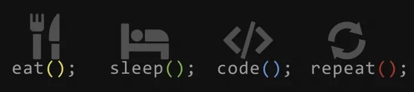

<div align="center">
  
</div>

<p align="center">
  <a href="https://github.com/Shantanu-Ch">
    
  </a>
</p>

<!-- ✅ Typing animated quote -->
<p align="center">
  
</p>


<h3 align="center">Full-Stack & Data Engineer | AI & Microservices</h3>

<!-- ✅ Marquee for key roles -->
<p align="center">
  <marquee behavior="scroll" direction="left" scrollamount="8">
    🚀 Full-Stack Developer | 📊 Data Engineer | 🧠 Microservices & AI Explorer | 🎓 MCA Student @ LPU
  </marquee>
</p>

---

<!-- ✅ Background Banner -->
<p align="center">
 
</p>

<p align="center">  
  
  <a href="https://visitcount.itsvg.in"></a>
</p>

### 🚀 About Me
---
I'm Shantanu Chhetri, a Full-Stack &amp; Data Engineer currently pursuing my Master of Computer Applications (MCA) at Lovely Professional University (graduated BCA with an aggregate CGPA of 9.38).

🔭 &nbsp;I'm currently working on **Building Konnect, a cloud-native microservices chat app with real-time PyTorch/Kafka NLP moderation.**  
🌱 &nbsp;I'm currently learning **Advanced LLM agentic workflows, LangChain, vector search, and cloud orchestration with Docker and GCP.**  
👯 &nbsp;I'm looking to collaborate on **Open-source full-stack web applications, real-time microservices, and data engineering projects.**  
🤔 &nbsp;I'm looking for help with **Optimizing low-latency deep learning model inference in distributed streaming architectures.**  
💬 &nbsp;Ask me about **React, Node.js, Python, SQL, Power BI, machine learning pipelines, and microservices design.**  
😄 &nbsp;Pronouns: **He / Him**  
⚡ &nbsp;Fun fact: **I trained an NLP model that knows the difference between toxic language and saying "this exam is killing me"!**

### 🛠️ Tech Stack
---
### 💻 Languages


### 🌐 Web & Frameworks


### 🗄️ Databases & Cloud Platform


### 📈 Data Analytics, ML & AI Tools


### 🔗 Connect With Me

<p align="left">
  <a href="https://www.linkedin.com/in/shantanu-chhetri/"></a>
  <a href="mailto:shantanuchhetri7@gmail.com"></a>
</p>

### 🛠 Featured Projects
---
### 🔹 [Konnect: Microservices Chat & NLP Moderation](https://github.com/Shantanu-Ch)
> **Stack:** Node.js, Express, Python, Next.js 15, Kafka, Redis, MongoDB, PyTorch, Docker, Traefik
- **Architecture:** Cloud-native 6-service microservices platform routed via Traefik v3.0, featuring JWT/OAuth 2.0, RBAC, and real-time Socket.IO communication.
- **Asynchronous Pipeline:** Streamed dual PyTorch models (RoBERTa & Toxic-BERT) through Apache Kafka (KRaft mode) achieving 312ms latency off the critical path.
- **Smart Moderation:** Engineered post-classification regex dampening engine that reduced false-positive flags by 38% while maintaining 97.2% true-positive recall.

### 🔹 [Weather Info Hub](https://github.com/Shantanu-Ch)
> **Stack:** Modular Vanilla JavaScript (ES6+), HTML5, CSS3, OpenWeatherMap API
- **Features:** Responsive SPA serving real-time meteorological data for 200,000+ cities with debounced search queries and sub-second render performance.
- **Reliability:** Built-in error-handling logic (try-catch) to manage non-200 HTTP statuses, network timeouts, and graceful UI fallbacks.


### 📚 Currently Learning & Exploring
---
```yaml
currently_focused_on:
  - LLM Agentic Workflows & LangChain
  - Vector Databases & RAG Applications
  - Advanced Microservice Design Patterns
  - Distributed Systems Optimization
```

### 📊 GitHub Stats
---
<p align="center">
  
  
</p>

### 📈 Contribution Graph
---
<p align="center">
  
</p>

### 💭 Dev Quote
---
<p align="center">
  
</p>
  <p align="center">
    ════ ⋆★⋆ ════<br>
    "Code cleanly, analyze deeply, and build systems that scale." 👨‍💻
  </p>
